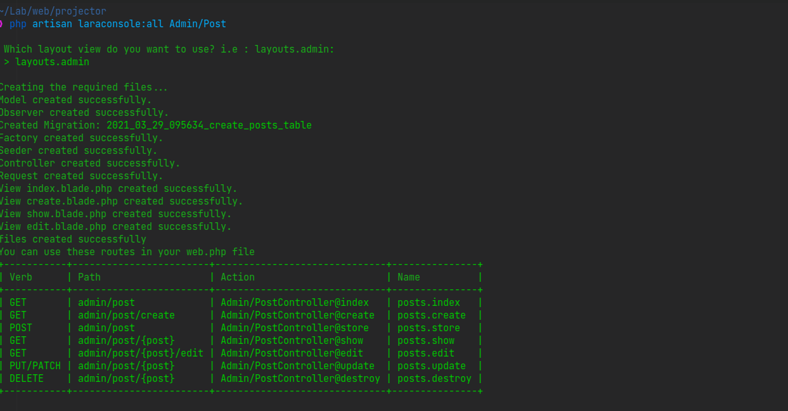

# Laraconsole

## A useful Laravel command list

The ``php artisan laraconsole:all {name}`` command
This command will create :
 - a Model, adding a doc to have a better completion
 - a Migration
 - a Seeder, add return types
 - a Factory, add return types
 - an Observer, generated with the model and all FQN are simplified
 - a FormRequest, authorize is set to true by default
 - a Controller, with functional code inside
 - Blade views, the extends and the section are already completed 
   
It also displays the layout of the roads in a table

The ``php artisan laraconsole:fill {model}`` command
this command will retrieve the fillable fields and will allow you to fill them in as a question, it will then save the registered data in the database
